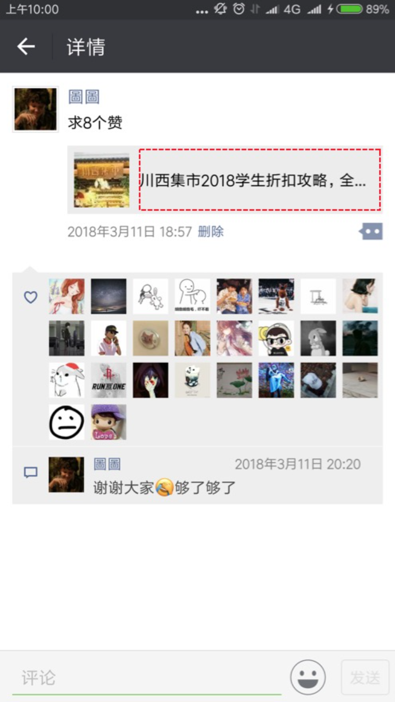
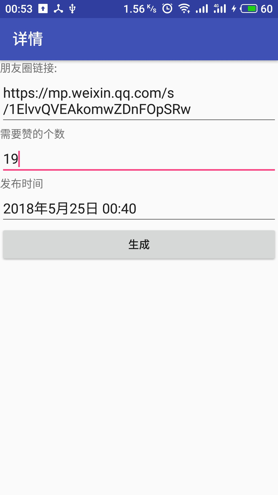
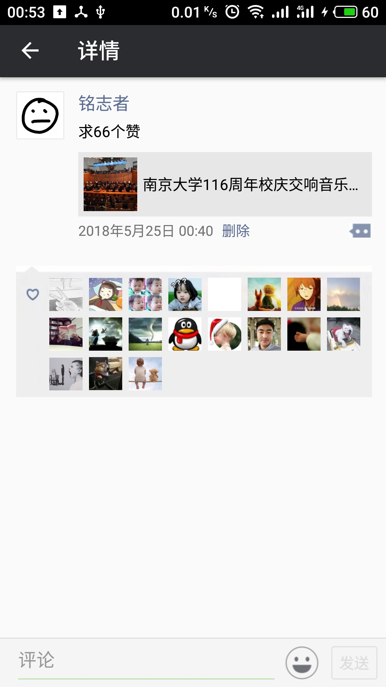
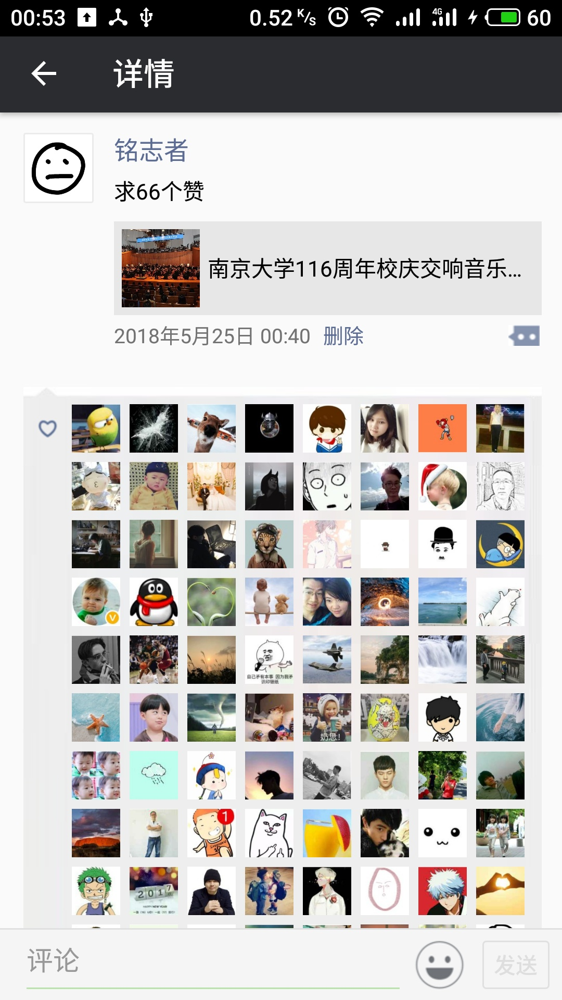
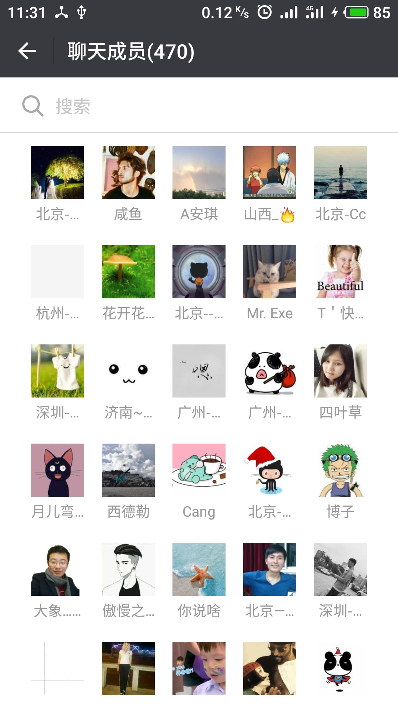
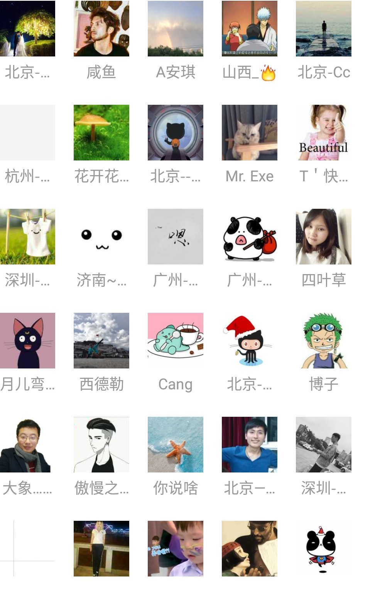

#WeiXinGood
微信朋友圈详情界面模仿

各个组织营销方式多种多样，最常见的就是分享朋友圈集赞：分享朋友圈集赞领小礼品，分享朋友圈打88折

哇！！！我的朋友圈总人数都不到20个，你居然让我集66个赞！！！

小小的优惠让我真的控制不住自己啊！！！

这个app应运而生
### 微信截图
 
### 模仿截图

最多可模仿210人点赞(因为apk里面只存放了210个头像……)
<figure class="third">
    
    
    
</figure>

### 设置微信昵称

修改 values/strings.xml文件中的weixin_name值
```
<resources>
    <string name="app_name">WeixinGood</string>
    <string name="weixin_name">铭志者</string>
</resources>
```

### 设置微信头像

替换 drawable/people.png文件

### 替换微信点赞人头像

1. 微信点赞人头像是保存在 drawable/p**.png文件的，替换的时候直接替换文件，名字保留
2. 如果修改了微信点赞人头像文件名称，请修改PeopleUtil.java中的IDs中相关的资源文件

### 适配问题

我是用魅族MX6 安卓版本7.1 如果存在适配问题，请自行修改layout/activity_detail.xml文件

### 微信头像截取脚本介绍

1. 首先微信屏幕截图

	 
2. 根据截图工具按照第一个头像的左上角进行截图

	 
3. 使用python3 修改python/picGet.py 中的路径, 如果出现白边，修改像素大小